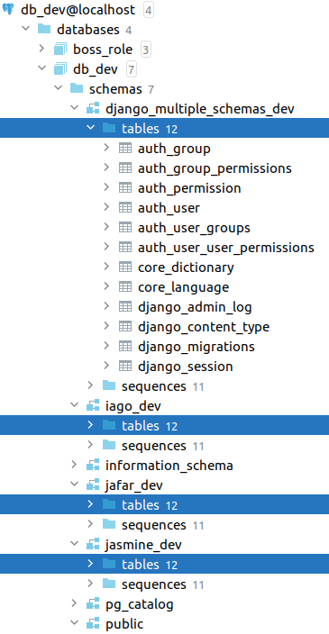

# Django Multiple Schemas

[](https://github.com/psf/black)
[](https://sonarcloud.io/dashboard?id=willianantunes_django-multiple-schemas)
[](https://sonarcloud.io/dashboard?id=willianantunes_django-multiple-schemas)

Here you'll find an honest project that shows how to use schema with Django. It has a script that creates all the scenario the project needs in PostgreSQL, it even has tests to guarantee that it is created as expected. Check more details below!

## Some basic details

You can check it out consulting [initialize-database.sh](./scripts/docker-entrypoint-initdb.d/initialize-database.sh) file.

I created a test script where it guarantees the script executed as expected. Check [test_initialize_database.py](./tests/integration/scripts/docker-entrypoint-initdb.d/test_initialize_database.py) to know more. Great place of reference [here](https://github.com/psycopg/psycopg2/tree/master/tests). 

The result is like the following (it may be outdated):



## Development

### Updating pipenv dependencies

If you update Pipfile, you can issue the following command to refresh your lock file:

    docker-compose run remote-interpreter pipenv update

## Playing with PostgreSQL

First execute the following:

    docker-compose up -d db

When it's UP, enter the container through the command:

    docker exec -it django-multiple-schemas_db_1 bash

You can do this as well:

    docker-compose exec db bash

We're accessing through `bash`, but you are able to access `psql` directly.

Then execute the command `psql -U boss_role` (check if the user matches with what is in [docker-compose.yaml](./docker-compose.yaml)) to be able to execute SQL commands direct to the database.

### Listing all the schemas

Sample output of the command `select schema_name from information_schema.schemata;`:

```text
    schema_name     
--------------------
 pg_toast
 pg_catalog
 public
 information_schema
(4 rows)
```

### Listing all database

Sample output of the command `SELECT datname FROM pg_database WHERE datistemplate = false;`:

```text
           datname           
-----------------------------
 postgres
 django_multiple_schemas_dev
(2 rows)
```
