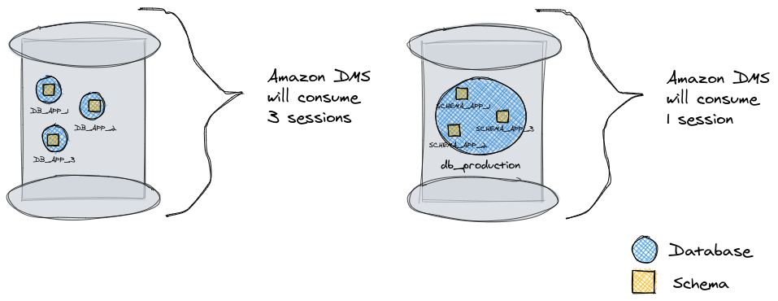

# Django Multiple Schemas

[](https://github.com/psf/black)
[](https://sonarcloud.io/dashboard?id=willianantunes_django-multiple-schemas)
[](https://sonarcloud.io/dashboard?id=willianantunes_django-multiple-schemas)

Here you'll find an honest project that shows how to use schema with Django. It has a script that creates all the scenario the project needs in PostgreSQL, it even has tests to guarantee that it is created as expected. Check more details below!

## Running the project and checking multiple schemas working

Execute `docker-compose up -d remote-interpreter jafar-app iago-app jasmine-app`. After they are running, you can check the database through its port (you can use a client for that, like [DataGrip](https://www.jetbrains.com/datagrip/)). If you'd like to access `remote-interpreter` service administration panel, access `http://0.0.0.0:8000/` and use `admin` for _username_ and _password_.

All the services can be accessed through their admin interface. Please see [docker-compose.yaml](./docker-compose.yaml) to figure out which port to use.

## Why this project?

If you are in a scenario where there are many applications using the same database machine, it's advisable to create one single database, let's say `db_production`, and then separate each application by its own schema (we can understand it as a folder). This is quite important because if you are using a CDC (Change Database Capture) solution like [Amazon DMS](https://aws.amazon.com/dms/), it consumes an entire session (know more about it [here](https://aws.amazon.com/blogs/database/analyzing-amazon-rds-database-workload-with-performance-insights/)) per database, which is a quite expensive resource. 

Let's say you have three Apps and each one has its own database. If your company needs data from these three databases, then three sessions will be consumed. Now if you're using schemas, only one. To illustrate:



## Some basic details

You can check it out consulting [initialize-database.sh](./scripts/docker-entrypoint-initdb.d/initialize-database.sh) file.

I created a test script where it guarantees the script executed as expected. Check [test_initialize_database.py](./tests/integration/scripts/docker-entrypoint-initdb.d/test_initialize_database.py) to know more. Great place of reference [here](https://github.com/psycopg/psycopg2/tree/master/tests). 

The result is like the following (it may be outdated):


## FAQ

1. Why you created `PYTEST_RUNNING` in `settings.py`?

Actually it is not needed. The default schema is `public`, so you can configure `DB_SCHEMA` with it, but my idea is to show that you can use `django_multiple_schemas_dev` to run your application, so instead of creating a dedicated environment file for tests, I just use one for tests and to run the application.

2. Do I need `PYTEST_RUNNING` in my real application?

No, you don't. Actually you must configure `DB_SCHEMA` with the value `public`.

3. Why did you apply `CREATEDB` for the application ROLE?

Because when you use `@pytest.mark.django_db` fixture, pytest will create a dedicated database for your test. It will use `test_` followed by your database name.

4. Which kind of [ROLE](https://www.postgresql.org/docs/13/database-roles.html) does my application need?

The basic thing is that your application should run with a role that can do full DQL and DML on the target schema, but not DDL. If you'd like to run `python manage.py migrate`, you can use a dedicated role just for that.

5. Can I configure multiple schemas in a single Django Application?

Yes, it's possible. Django can only apply migration to one folder/schema per database/entry configured in `DATABASES` dict variable in `settings.py`. If you check [here](https://github.com/willianantunes/django-multiple-schemas/blob/2deb15de36d1229f19bd4422d3f55b0d7a57a797/django_multiple_schemas/settings.py#L85), you will see that I'm using only one database that is identified as `default`. Now if you need multiple schemas, let's say two, you can have `default` key followed by `my-another-setup`, and then use another schema in it.

6. Can [search path](https://github.com/willianantunes/django-multiple-schemas/blob/2deb15de36d1229f19bd4422d3f55b0d7a57a797/django_multiple_schemas/settings.py#L89) has more than one schema?

Yes. You can have something like `-c search_path=iago_dev,jafar_dev`.

## Development

### Updating pipenv dependencies

If you update Pipfile, you can issue the following command to refresh your lock file:

    docker-compose run remote-interpreter pipenv update

## Playing with PostgreSQL

First execute the following:

    docker-compose up -d db

When it's UP, enter the container through the command:

    docker exec -it django-multiple-schemas_db_1 bash

You can do this as well:

    docker-compose exec db bash

We're accessing through `bash`, but you are able to access `psql` directly.

Then execute the command `psql -U boss_role` (check if the user matches with what is in [docker-compose.yaml](./docker-compose.yaml)) to be able to execute SQL commands direct to the database.

### Listing all the schemas

Sample output of the command `select schema_name from information_schema.schemata;`:

```text
    schema_name     
--------------------
 pg_toast
 pg_catalog
 public
 information_schema
(4 rows)
```

### Listing all database

Sample output of the command `SELECT datname FROM pg_database WHERE datistemplate = false;`:

```text
           datname           
-----------------------------
 postgres
 django_multiple_schemas_dev
(2 rows)
```
